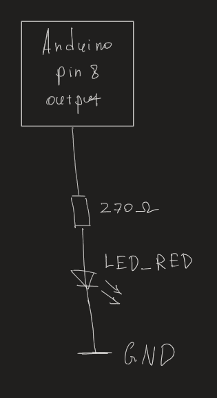

# Lab 1: KHAIBULLIN Rishat

### Morse code

1. Listing of C code which repeats one "dot" and one "comma" (BTW, in Morse code it is letter `A`) on a LED. Always use syntax highlighting, meaningful comments, and follow C guidelines:

```c
int main(void)
{
    pinMode(LED_RED, OUTPUT);        // Nastaveni pinu LED_RED (PB0 8) na vystup
    
    while (1)                        // Nekonecna smycka
    {
        digitalWrite(LED_RED, 0);    // Vypnuti LED 
        _delay_ms(DELAY);            // Zpozdeni 250 ms (mezi signaly)
        digitalWrite(LED_RED, 1);    // Zapnuti LED
        _delay_ms(SHORT_DELAY);      // Zpozdeni 500 ms
        digitalWrite(LED_RED, 0);
        _delay_ms(DELAY);            // Zpozdeni 250 ms (mezi signaly)
        digitalWrite(LED_RED, 1);
        _delay_ms(LONG_DELAY);       // Zpozdeni 1000 ms
        digitalWrite(LED_RED, 0);
        _delay_ms(2500);             // Zpozdeni po zobrazeni pismana 'A'

    }

    return 0;
}
```

2. Scheme of Morse code application, i.e. connection of AVR device, LED, resistor, and supply voltage. The image can be drawn on a computer or by hand. Always name all components and their values!

   
