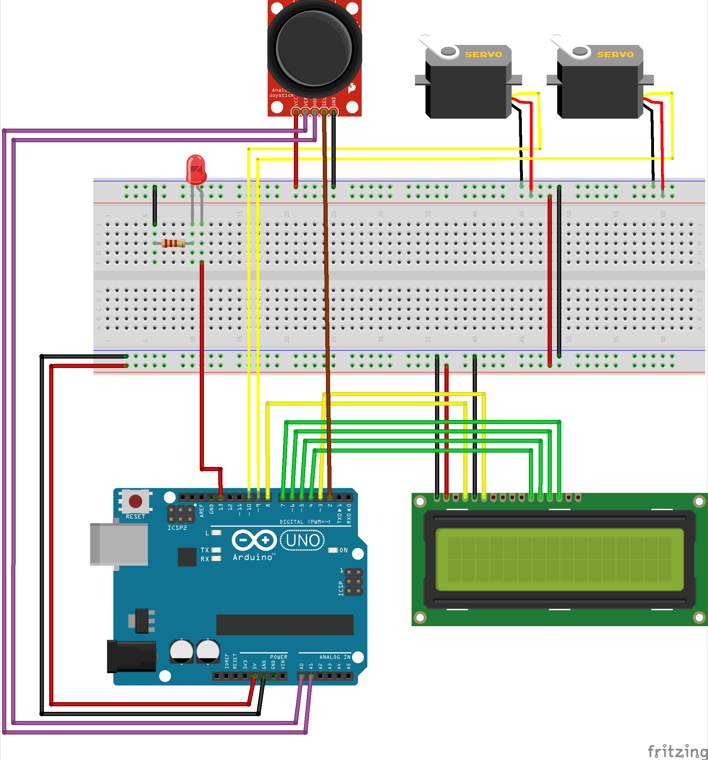
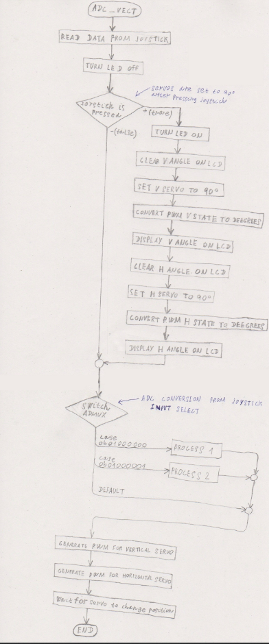
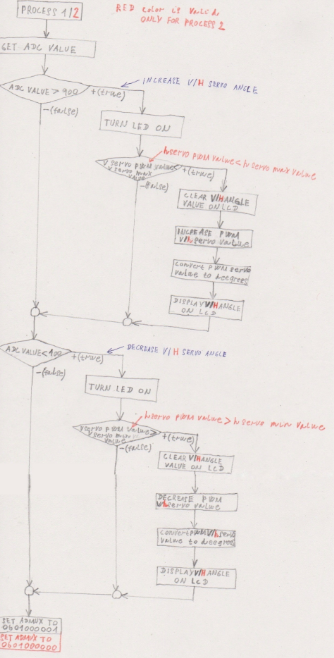

# Project 2

Precise generation of several PWM channels. Application of two Servo motors SG90.

### Team members

* Rishat Khaibullin (responsible for making joystick part of project, schematic of project and it description)
* Marian Dvořáček (responsible for making servo and LCD part of project, flowcharts of functions)

## Hardware description

The goal of this project was to generate a PWM signal using an Arduino board. We used part of the code from the first project, namely joystick manipulation, that is, ADC conversion, displaying data on the LCD and signaling on the LED (for clarity). From the mechanical part, two servo motors were added to the project.

In this project, we used:
1. Arduino UNO
2. Joy-stick (2 ADC channels, 1 push button)
3. 2x Servo motors SG90 (1 digital channel)
4. Digilent PmodCLP LCD module
5. LED
6. Resistor (around 150 ohm)

The Arduino board is capable of generating a PWM signal. For a short time, voltage is applied to the pin, and then nothing is applied, if in this way the voltage is applied and turned off on the pin with a constant frequency, then we will get a PWM signal. The ratio of the duration of the high voltage level and the duration of the low voltage is called the duty cycle. For example, if you apply voltage for 0.5s to a pin and turn it off for 1.5s (period of 2s), then the duty cycle will be 25%, so if an LED with a resistor is connected to this pin, the LED will glow at 25% of its power /brightness. This is the principle of the PWM signal.

> 
> 
> **Note:** Connection diagram of the project to the Arduino board.

## Software description

The main function code was 254 lines. The entire program used 42 bytes (2.1%) of RAM and 2174 bytes (6.7%) of Flash.

To begin with, let's consider the main function, where the ports are configured, the LCD is initialized, as well as the configuration of registers for ADC conversion and the configuration of registers for the PWM signal. The program used a 16-bit Timer1 with 256 prescale, for which the overflow interrupt routine was enabled. We used a 10-bit phase corrected PWM and a non-inverted mode for the registers.

The core of the program for processing a PWM signal is the `convertAngleToDeegrees` function, where data is sent for processing. Before the start, a servo calibration was carried out, where we found out that setting the servo to the begining position (0 degrees) is `min_servo = 16`, and for the final position (180 degrees) it is `max_servo = 74` (these figures may differ when using other types of servos or another timer). Since we need to control two servos, we used the vertical axis of the joystick for one servo and the horizontal axis for the other servo. The `convertAngleToDeegrees` function first calculates the number of steps required to cover the entire distance, then calculates the angle of rotation by one degree. And if the actual PWM value changes, then the servos are set in motion (that is, the duty cycle readings for a certain angle change).

In the ADC_vect function, the changes in the joystick movement vertically and horizontally, as well as when the joystick button is pressed, are determined. When you press the button, the servo position moves to the middle (90 degrees). With each change in the position of the joystick, an ADC conversion is performed, as well as indicators of the angle of inclination are written out on the LCD display.

This way we can control two servos with one joystick. Such control can be carried out in various other projects, for example, for driving a vehicle.

## Video

https://youtu.be/d9GIebsl2gA

## References

1. Presentations of lecture
2. Labs files
