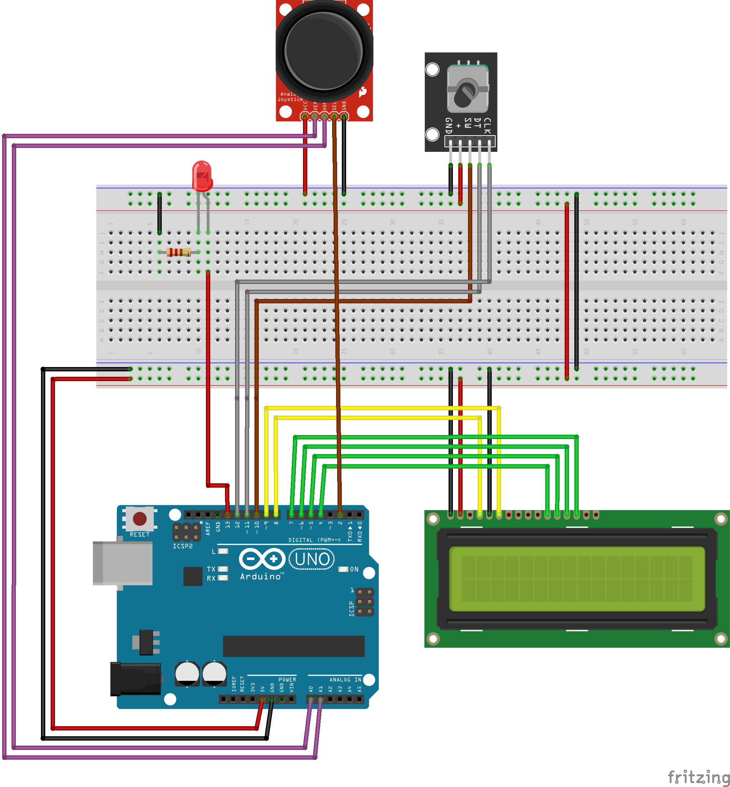

# Project 1

Application of analog joy-stick (2 ADC channels, 1 push button), rotary encoder, and Digilent PmodCLP LCD module.

## Instructions

The goal of the project is cooperation in pairs, further study of the topic, design of own solutions, implementation, creation of project documentation and presentation of results. The division of roles and tasks within the team is up to their members.

* Students work on a project in the labs during the 10th and 11th weeks of the semester.

* Through the BUT e-learning, students submit a link to the GitHub repository, which contains the complete project in PlatfomIO and a descriptive README file. The submission deadline is the day before the next laboratory, i.e. in 2 weeks.

* The source code for the AVR must be written in C and/or Assembly and must be implementable on Arduino Uno board using toolchains from the semester, ie PlatformIO and not the Arduino-style. No other development tools are allowed.

## Recommended GitHub repository structure

   ```c
   YOUR_PROJECT        // PlatfomIO project
   ├── include         // Included files
   ├── lib             // Libraries
   ├── src             // Source file(s)
   │   └── main.c
   ├── test            // No need this
   ├── platformio.ini  // Project Configuration File
   └── README.md       // Report of this project
   ```

## Recommended README.md file structure

### Team members

* Rishat Khaibullin (responsible for making joystick and LCD part of project)
* Marian Dvořáček (responsible for making encoder and LCD part of project)

## Hardware description

The main goal of our project was to study the use of given components and create a common system.

In this project, we used:
1. Arduino UNO
2. Joy-stick (2 ADC channels, 1 push button)
3. Rotary encoder (2 digital channels, 1 push button)
4. Digilent PmodCLP LCD module
5. LED
6. Resistor (around 150 ohm)

The Arduino served as the core of the project. The joystick moves the cursor/symbol on the LCD display size 16x2. By turning the encoder, the user can select different symbol from the ASCII table. It is worth noting that when choosing symbols, there are no custom symbols that are initially empty. When you press the enecoder button, the value of the symbol is returned to the beginning of the list for convenience, i.e. to the symbol `!`. When you press the joystick button, the value of this given character will appear on the screen, in our case it is the character `0xef`. Also in the project was used LED with a resistor to indicate the operation of the ADC conversion.




## Software description

The main function code was 280 lines. The entire program used 171 bytes (8.3%) of RAM and 1818 bytes (5.6%) of Flash.

In this project, libraries were used that were previously used in past labs. These are libraries `LCD` for working with a display, an `UART` library for displaying parameters in the console, a `GPIO` library for signal processing on pins, and a `timer.h`. All the work of our project is in the `main.c` file.

After assigning all the pins used, defining global constants, as well as connecting all the necessary libraries, the main function follows. In the main function, the pin mode is assigned as input or output, then the register for ADC conversion is also assigned, Timer1 is turned on with a prescaler of 33 ms, as well as an interrupt. At the end, the program ends with an endless loop, where the functions `ISR(TIMER1_OVF_vect)` and `ISR(ADC_vect)` are processed.


## Video

Insert a link to a short video with your practical implementation example (1-3 minutes, e.g. on YouTube).

## References

1. Write your text here.
2. ...
